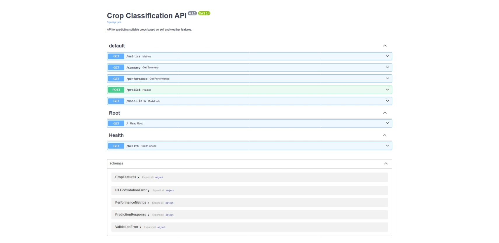
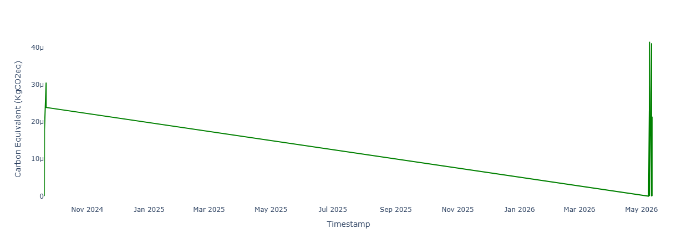

# 🌾 Crop Classification MLOps Pipeline

[](https://python.org)
[](https://fastapi.tiangolo.com)
[](https://mlflow.org)
[](https://docker.com)
[](https://dagshub.com/ushafique/CropClassification)
[](https://github.com/ozairshafique/crop-classification-mlops/actions/workflows/ci.yml)
[](LICENSE)

> A production-grade **end-to-end MLOps pipeline** for crop classification
> that predicts the most suitable crop based on soil and environmental
> conditions. Built with industry-standard tools including FastAPI, Docker,
> MLflow, DVC, Prometheus, Grafana, and Great Expectations.

---

## 📊 Monitoring Dashboard


---

## 🎯 Model Performance

| Metric           | Score        |
| ---------------- | ------------ |
| **Accuracy**     | **94.32%**   |
| **Precision**    | **96.30%**   |
| **Recall**       | **94.32%**   |
| **F1-Score**     | **93.33%**   |
| **Classes**      | **22 crops** |
| **Test Samples** | **440**      |

---

## 🛠️ Tech Stack

| Category                | Tools                    |
| ----------------------- | ------------------------ |
| **Language**            | Python 3.12              |
| **ML Framework**        | Scikit-learn             |
| **Model**               | Random Forest Classifier |
| **API**                 | FastAPI + Uvicorn        |
| **Experiment Tracking** | MLflow + DagsHub         |
| **Data Versioning**     | DVC + DagsHub            |
| **Monitoring**          | Prometheus + Grafana     |
| **Data Validation**     | Great Expectations       |
| **Carbon Tracking**     | CodeCarbon               |
| **Load Testing**        | Locust                   |
| **Containerization**    | Docker + Docker Compose  |
| **Testing**             | Pytest                   |
| **Code Quality**        | Flake8 + Pylint          |
| **CI/CD**               | GitHub Actions           |
| **Cloud**               | AWS EC2                  |

---

## 🏗️ Architecture

```
Raw Data (DVC + DagsHub)
   ↓
Data Validation (Great Expectations)
   ↓
Data Processing (make_dataset.py)
   ↓
Model Training (Random Forest)
   ↓
Experiment Tracking (MLflow + DagsHub)
   ↓
Model Evaluation (94.32% accuracy)
   ↓
FastAPI REST API
   ↓
Docker Compose (Full Stack)
   ↓
Monitoring (Prometheus + Grafana)
   ↓
Load Testing (Locust)
   ↓
CI/CD (GitHub Actions → AWS EC2)
```

---

## 📈 MLflow Experiments


🔗 [View all experiments on DagsHub](https://dagshub.com/ushafique/CropClassification.mlflow)

---

## 🌐 API Documentation



🔗 Live API: [http://63.180.13.157:8001/docs](http://63.180.13.157:8001/docs)

---

## 🔥 Load Testing Results

Tested with **100 concurrent users** at **42.5 RPS** — **0% failure rate**:


| Endpoint         | Requests   | Failures | Median (ms) | 90th % (ms) | RPS      |
| ---------------- | ---------- | -------- | ----------- | ----------- | -------- |
| POST /predict    | 6,039      | 0        | 340         | 1,100       | 22.6     |
| GET /summary     | 1,227      | 0        | 330         | 800         | 5.5      |
| GET /model-info  | 2,312      | 0        | 31          | 190         | 7.6      |
| GET /performance | 1,103      | 0        | 47          | 220         | 3.3      |
| GET /health      | 100        | 0        | 16          | 62          | 0.0      |
| **Aggregated**   | **11,951** | **0**    | **160**     | **880**     | **42.5** |

✅ **0% failure rate** with 100 concurrent users

---

## 🌱 Carbon Footprint


| Metric            | Value  |
| ----------------- | ------ |
| CO2 per Training  | ~0.0 g |
| CO2 per Inference | ~0.0 g |
| Model Size        | 799 kB |
| Energy Rating     | A      |

Carbon tracked using [CodeCarbon](https://codecarbon.io/)

### 📈 Emissions Timeline


### 📊 Emissions Per Training Run



---

## 📁 Project Structure

```
crop-classification-mlops/
│
├── apis/                          # FastAPI application
│   ├── __init__.py
│   ├── main.py                    # FastAPI app & endpoints
│   └── schemas.py                 # Pydantic schemas
│
├── src/                           # Core source code
│   ├── data/
│   │   └── make_dataset.py        # Data processing
│   ├── data_validation/
│   │   └── data_expectations.py   # Great Expectations validation
│   └── models/
│       ├── evaluate.py            # Model evaluation
│       ├── predict_model.py       # Model prediction
│       └── train_model.py         # Model training
│
├── data/
│   ├── README.md                  # Dataset documentation
│   ├── raw/                       # Raw CSV data (DVC)
│   └── processed/                 # Processed data (DVC)
│
├── models/
│   ├── model.pkl                  # Trained model (DVC)
│   ├── label_encoder.pkl          # Label encoder (DVC)
│   └── metrics.json               # Model metrics
│
├── reports/
│   ├── model_card.md              # Model card
│   ├── report.md                  # Evaluation report
│   └── train_model_emissions_report.txt
│
├── tests/
│   ├── __init__.py
│   ├── locustfile.py              # Load tests
│   ├── test_evaluate.py           # Evaluation tests
│   └── test_train_model.py        # Training tests
│
├── grafana/
│   └── dashboard.json             # Grafana dashboard config
│
├── gx/                            # Great Expectations
│   ├── checkpoints/
│   └── expectations/
│
├── images/                        # README images
│
├── .github/
│   └── workflows/
│       └── ci-cd.yml              # CI/CD pipeline
│
├── dvc.yaml                       # DVC pipeline stages
├── dvc.lock                       # DVC lock file
├── Dockerfile
├── docker-compose.yml
├── prometheus.yml
├── requirements.txt
├── pytest.ini
├── .flake8
├── .env.example
├── .gitignore
└── README.md
```

---

## 🚀 Quick Start

### Prerequisites

- [Docker Desktop](https://www.docker.com/products/docker-desktop/)
- [Git](https://git-scm.com/)
- Python 3.12+

### 1. Clone Repository

```bash
git clone https://github.com/ozairshafique/crop-classification-mlops.git
cd crop-classification-mlops
```

### 2. Setup Environment

```bash
cp .env.example .env
```

Edit `.env` with your values:

```env
DAGSHUB_USERNAME=yourusername
DAGSHUB_REPO=CropClassification
DAGSHUB_TOKEN=yourtoken
MLFLOW_TRACKING_URI=https://dagshub.com/yourusername/CropClassification.mlflow
GRAFANA_ADMIN_USER=admin
GRAFANA_ADMIN_PASSWORD=yourpassword
```

### 3. Pull Data with DVC

```bash
dvc remote add dagshub https://dagshub.com/ushafique/CropClassification.dvc
dvc remote modify dagshub --local auth basic
dvc remote modify dagshub --local user your_username
dvc remote modify dagshub --local password your_token
dvc pull -r dagshub --force
```

### 4. Run with Docker

```bash
docker compose up -d
```

### 5. Access Services

| Service        | URL                        | Description |
| -------------- | -------------------------- | ----------- |
| **FastAPI**    | http://localhost:8001      | REST API    |
| **API Docs**   | http://localhost:8001/docs | Swagger UI  |
| **Prometheus** | http://localhost:9091      | Metrics     |
| **Grafana**    | http://localhost:3002      | Dashboard   |

---

## 💻 Local Development

### 1. Create Virtual Environment

```bash
python -m venv envs

# Windows
envs\Scripts\activate

# Linux/Mac
source envs/bin/activate
```

### 2. Install Dependencies

```bash
pip install -r requirements.txt
```

### 3. Run DVC Pipeline

```bash
dvc repro
```

### 4. Run API

```bash
uvicorn apis.main:app --reload --port 8000
```

---

## 📡 API Endpoints

| Method | Endpoint       | Description           |
| ------ | -------------- | --------------------- |
| GET    | `/`            | Root — API info       |
| GET    | `/health`      | Health check          |
| GET    | `/docs`        | Swagger documentation |
| GET    | `/summary`     | Dataset summary       |
| GET    | `/performance` | Model performance     |
| GET    | `/model-info`  | Model information     |
| POST   | `/predict`     | Crop prediction       |
| GET    | `/metrics`     | Prometheus metrics    |

### Prediction Example

**Request:**

```bash
curl -X POST http://localhost:8001/predict \
  -H "Content-Type: application/json" \
  -d '{
    "Nitrogen": 50,
    "Phosphorus": 30,
    "Potassium": 40,
    "Temperature": 20.0,
    "Humidity": 60.0,
    "pH_Value": 6.0,
    "Rainfall": 100.0
  }'
```

**Response:**

```json
{
  "predicted": "Rice",
  "input_data": {
    "Nitrogen": 50,
    "Phosphorus": 30,
    "Potassium": 40,
    "Temperature": 20.0,
    "Humidity": 60.0,
    "pH_Value": 6.0,
    "Rainfall": 100.0
  },
  "message": "Prediction successful"
}
```

---

## 🧪 Testing

### Unit Tests

```bash
pytest tests/ -v --cov=src/
```

### Load Testing with Locust

```bash
locust -f tests/locustfile.py --host=http://localhost:8001
```

Open http://localhost:8089:

| Setting    | Value                 |
| ---------- | --------------------- |
| Users      | 100                   |
| Spawn rate | 10/sec                |
| Host       | http://localhost:8001 |

---

## 🔄 CI/CD Pipeline

GitHub Actions runs automatically on every push to `main` or `dev`:

```
Push to main/dev
     ↓
Code Quality (Flake8 + Pylint)
     ↓
Run Tests (DVC + Pytest)
     ↓
Build Docker Image
     ↓
Push to Docker Hub
     ↓
Deploy to AWS EC2
     ↓
Health Check ✅
```

---

## 🗂️ Data Validation

Using Great Expectations:

| Validation       | Description               |
| ---------------- | ------------------------- |
| Column existence | All 8 columns present     |
| Value ranges     | Nitrogen 0-140, pH 0-14   |
| Null checks      | No missing values allowed |
| Data types       | Numeric columns verified  |

---

## 📦 Model Details

| Parameter         | Value                    |
| ----------------- | ------------------------ |
| Algorithm         | Random Forest Classifier |
| n_estimators      | 200                      |
| max_depth         | 15                       |
| min_samples_split | 2                        |
| random_state      | 42                       |
| Training samples  | 1,760 (80%)              |
| Test samples      | 440 (20%)                |

---

## 📊 Grafana Dashboard

Import `grafana/dashboard.json` to get:

| Panel                 | Description        |
| --------------------- | ------------------ |
| Total Requests        | Request counter    |
| Error Rate            | 5xx error monitor  |
| App Health            | UP/DOWN status     |
| Total Predictions     | Prediction counter |
| Requests Per Minute   | Request rate chart |
| Average Response Time | Latency chart      |

---

## 📋 Documentation

| Document                                                     | Description               |
| ------------------------------------------------------------ | ------------------------- |
| [Model Card](reports/model_card.md)                          | Model details and metrics |
| [Evaluation Report](reports/report.md)                       | Performance analysis      |
| [Dataset Card](data/README.md)                               | Dataset documentation     |
| [Emissions Report](reports/train_model_emissions_report.txt) | Carbon footprint          |

---

## 🤝 Contributing

1. Fork the repository
2. Create feature branch

```bash
git checkout -b feature/your-feature
```

3. Commit changes

```bash
git commit -m "feat: add your feature"
```

4. Push to branch

```bash
git push origin feature/your-feature
```

5. Open Pull Request

---

## 📄 License

MIT License — see [LICENSE](LICENSE) for details.

---

## 👤 Author

**Uzair Shafique**

- 🐙 GitHub: [@ozairshafique](https://github.com/ozairshafique)
- 🔬 DagsHub: [@ushafique](https://dagshub.com/ushafique)
- 💼 LinkedIn: [uzair-shafique](https://www.linkedin.com/in/uzair-shafique-97836810a)

---

## 🙏 Acknowledgements

- Dataset: [Kaggle — Crop Recommendation](https://www.kaggle.com/datasets/atharvaingle/crop-recommendation-dataset)
- [FastAPI](https://fastapi.tiangolo.com/)
- [MLflow](https://mlflow.org/)
- [DVC](https://dvc.org/)
- [DagsHub](https://dagshub.com/)
- [Great Expectations](https://greatexpectations.io/)
- [CodeCarbon](https://codecarbon.io/)
- [Locust](https://locust.io/)
- [Prometheus](https://prometheus.io/)
- [Grafana](https://grafana.com/)

---

<div align="center">

⭐ **Star this repo if you found it helpful!** ⭐

</div>
