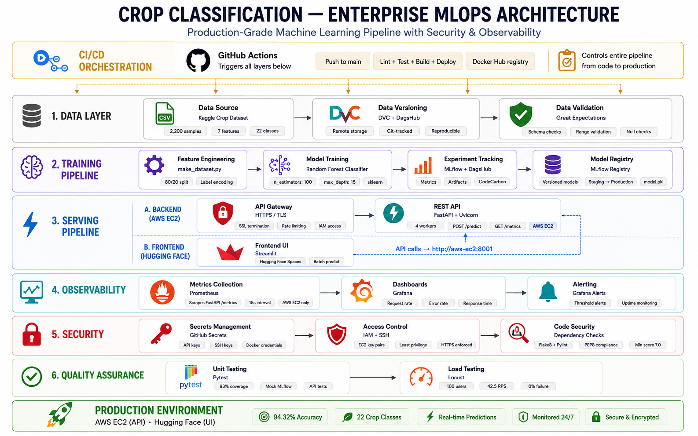
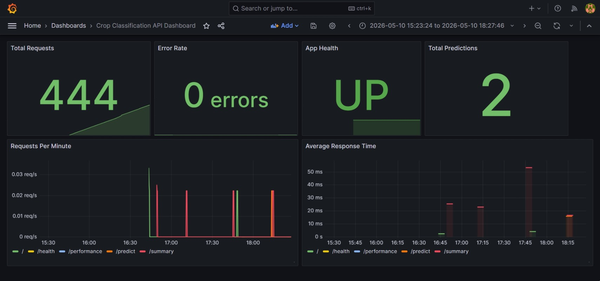
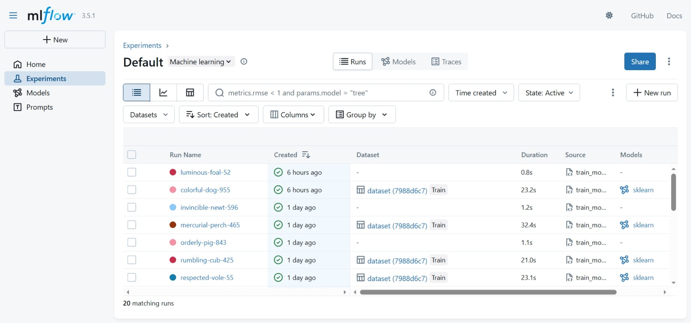
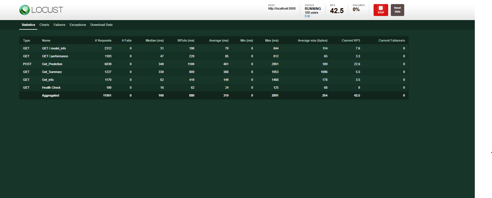
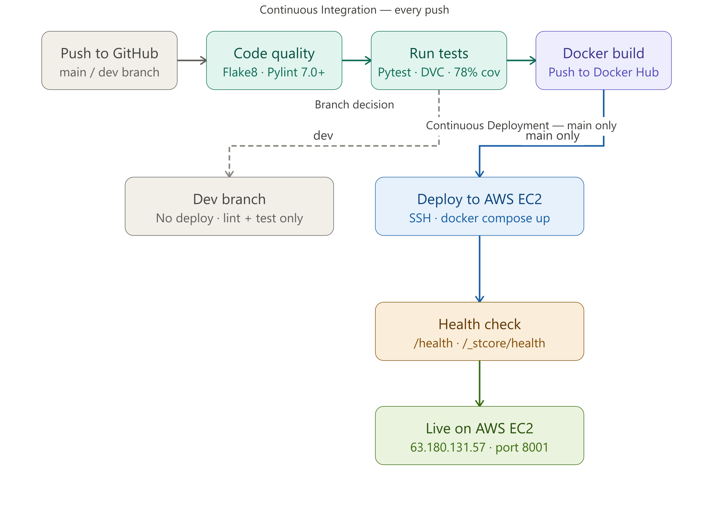
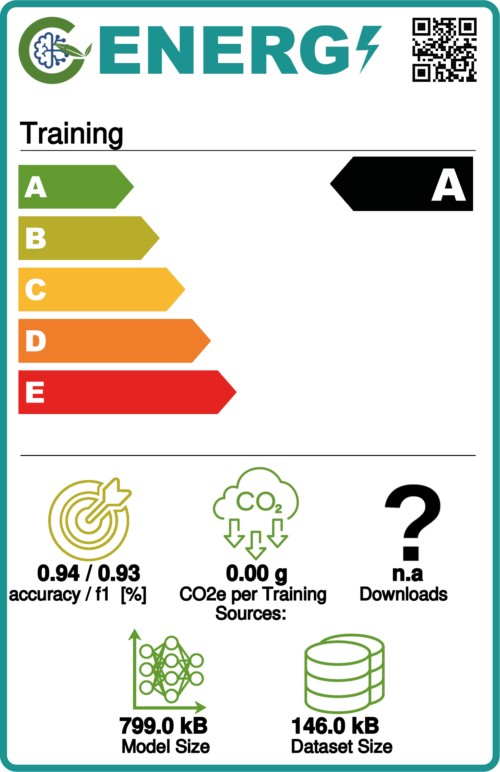
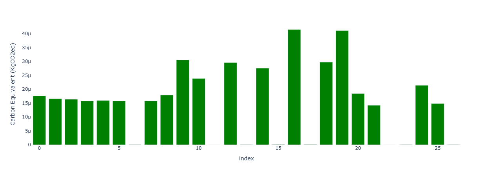

# 🌾 Crop Classification MLOps Pipeline

<div align="center">

[](https://python.org)
[](https://fastapi.tiangolo.com)
[](https://mlflow.org)
[](https://docker.com)
[](https://dagshub.com/ushafique/CropClassification)
[](https://streamlit.io)
[](https://prometheus.io)
[](https://grafana.com)
[](https://locust.io)
[](https://aws.amazon.com)
[]()
[](https://github.com/ozairshafique/crop-classification-mlops/actions/workflows/ci.yml)
[](LICENSE)
[](https://huggingface.co/spaces/ozair1112/crop-classifications)

<br/>

**A production-grade end-to-end MLOps pipeline for agricultural crop recommendation.**
Predicts the optimal crop based on soil nutrients and environmental conditions using a Random Forest classifier with **94.32% accuracy** across **22 crop types**.

<br/>

[🚀 Live Demo](https://huggingface.co/spaces/ozair1112/crop-classifications) · [📖 API Docs](http://63.181.6.23:8001/docs) · [🔬 MLflow Experiments](https://dagshub.com/ushafique/CropClassification.mlflow) · [🐳 Docker Hub](https://hub.docker.com/r/yourwhale/crops-classifications)

</div>

## 📋 Table of Contents

- [Overview](#-overview)
- [Live Demo](#-live-demo)
- [Model Performance](#-model-performance)
- [Architecture](#-architecture)
- [Tech Stack](#-tech-stack)
- [Project Structure](#-project-structure)
- [Quick Start](#-quick-start)
- [API Reference](#-api-reference)
- [Monitoring](#-monitoring)
- [Load Testing](#-load-testing)
- [CI/CD Pipeline](#-cicd-pipeline)
- [Testing](#-testing)
- [Carbon Footprint](#-carbon-footprint)
- [Model Details](#-model-details)
- [Data Validation](#-data-validation)
- [Contributing](#-contributing)
- [Documentation](#-documentation)
- [Author](#-author)

---

## 🎯 Overview

This project demonstrates a **complete MLOps lifecycle** — from raw data ingestion to a monitored, containerized, and cloud-deployed ML system. It is not just a model; it is a full production system built with the same tools and practices used in industry.

**What makes this different from a typical ML project:**

| Feature                  | Details                                                                       |
| ------------------------ | ----------------------------------------------------------------------------- |
| **Reproducibility**      | Data versioned with DVC + DagsHub — every experiment is reproducible          |
| **Experiment tracking**  | Every run logged in MLflow — metrics, params, and artifacts never lost        |
| **Data quality**         | Great Expectations enforces schema and value ranges before every training run |
| **Real-time monitoring** | Prometheus scrapes metrics every 15s, Grafana dashboards show live API health |
| **Load tested**          | 100 concurrent users, 42.5 RPS, **0% failure rate**                           |
| **Full automation**      | One push to `main` triggers lint → test → build → deploy to AWS EC2           |
| **Carbon tracking**      | CodeCarbon logs CO₂ emissions on every training and inference run             |
| **Dual deployment**      | FastAPI backend on AWS EC2, Streamlit frontend on Hugging Face Spaces         |

---

## 🌐 Live Demo

| Service               | URL                                                                                           | Status                                                              |
| --------------------- | --------------------------------------------------------------------------------------------- | ------------------------------------------------------------------- |
| 🤗 Streamlit UI       | [crop-classifications.hf.space](https://huggingface.co/spaces/ozair1112/crop-classifications) |  |
| ⚡ FastAPI REST API   | [63.181.6.23:8001/docs](http://63.181.6.23:8001/docs)                                         |  |
| 🔬 MLflow Experiments | [DagsHub](https://dagshub.com/ushafique/CropClassification.mlflow)                            |  |

---

## 📊 Model Performance

| Metric               | Score           |
| -------------------- | --------------- |
| **Accuracy**         | **94.32%**      |
| **Precision**        | **96.30%**      |
| **Recall**           | **94.32%**      |
| **F1-Score**         | **93.33%**      |
| **Classes**          | **22 crops**    |
| **Training Samples** | **1,760 (80%)** |
| **Test Samples**     | **440 (20%)**   |
| **Model Size**       | **799 kB**      |

---

## 🏗️ Architecture



---

## 🛠️ Tech Stack

| Category                | Tools                    |
| ----------------------- | ------------------------ |
| **Language**            | Python 3.12              |
| **ML Framework**        | Scikit-learn             |
| **Model**               | Random Forest Classifier |
| **API**                 | FastAPI + Uvicorn        |
| **Frontend**            | Streamlit                |
| **Experiment Tracking** | MLflow + DagsHub         |
| **Data Versioning**     | DVC + DagsHub            |
| **Data Validation**     | Great Expectations       |
| **Monitoring**          | Prometheus + Grafana     |
| **Carbon Tracking**     | CodeCarbon               |
| **Load Testing**        | Locust                   |
| **Containerization**    | Docker + Docker Compose  |
| **Testing**             | Pytest + Coverage (93%)  |
| **Code Quality**        | Flake8 + Pylint          |
| **CI/CD**               | GitHub Actions           |
| **Cloud**               | AWS EC2 (t3.small)       |
| **Registry**            | Docker Hub               |

---

## 📁 Project Structure

```
crop-classification-mlops/
│
├── apis/                          # FastAPI application
│   ├── __init__.py
│   ├── main.py                    # App, endpoints, Prometheus metrics
│   └── schemas.py                 # Pydantic request/response schemas
│
├── src/                           # Core ML source code
│   ├── data/
│   │   └── make_dataset.py        # Data ingestion and processing
│   ├── data_validation/
│   │   └── data_expectations.py   # Great Expectations validation suite
│   ├── features/
│   │   └── build_features.py      # Feature engineering
│   ├── models/
│   │   ├── evaluate.py            # Evaluation + MLflow logging
│   │   ├── predict_model.py       # Inference logic
│   │   └── train_model.py         # Training + MLflow + CodeCarbon
│   └── visualization/
│       └── visualize.py           # Plot generation
│
├── app/
│   └── streamlit_app.py           # Streamlit UI (Hugging Face)
│
├── data/
│   ├── README.md                  # Dataset documentation
│   ├── raw/                       # Raw CSV (DVC tracked)
│   └── processed/                 # Train/test splits (DVC tracked)
│
├── models/
│   ├── model.pkl                  # Trained model (DVC tracked)
│   ├── label_encoder.pkl          # Label encoder (DVC tracked)
│   └── metrics.json               # Evaluation metrics
│
├── reports/
│   ├── model_card.md              # Model card
│   ├── report.md                  # Evaluation report
│   └── train_model_emissions_report.txt  # Carbon report
│
├── tests/
│   ├── locustfile.py              # Load testing scenarios
│   ├── test_api.py                # API endpoint unit tests
│   ├── test_evaluate.py           # Evaluation unit tests
│   └── test_train_model.py        # Training unit tests
│
├── grafana/
│   └── dashboard.json             # Grafana dashboard (importable)
│
├── gx/                            # Great Expectations project
│   ├── checkpoints/
│   └── expectations/
│
├── images/                        # README screenshots
│
├── .github/
│   └── workflows/
│       └── ci.yml                 # Full CI/CD pipeline
│
├── dvc.yaml                       # DVC pipeline stages
├── dvc.lock                       # DVC reproducibility lock
├── Dockerfile                     # FastAPI image
├── Dockerfile.streamlit           # Streamlit image
├── docker-compose.yml             # Full stack orchestration
├── prometheus.yml                 # Prometheus scrape config
├── requirements.txt               # FastAPI dependencies
├── requirements-streamlit.txt     # Streamlit dependencies
├── pytest.ini                     # Pytest + coverage config
├── .coveragerc                    # Coverage exclusions
├── .flake8                        # Linting config
├── .env.example                   # Environment template
├── .gitignore
└── README.md
```

---

## 🚀 Quick Start

### Prerequisites

- [Docker Desktop](https://www.docker.com/products/docker-desktop/) 24+
- [Git](https://git-scm.com/)
- Python 3.12+
- DagsHub account (for DVC + MLflow)

### 1. Clone Repository

```bash
git clone https://github.com/ozairshafique/crop-classification-mlops.git
cd crop-classification-mlops
```

### 2. Setup Environment

```bash
cp .env.example .env
```

Edit `.env` with your credentials:

```env
DAGSHUB_USERNAME=yourusername
DAGSHUB_REPO=CropClassification
DAGSHUB_TOKEN=yourtoken
MLFLOW_TRACKING_URI=https://dagshub.com/yourusername/CropClassification.mlflow
GRAFANA_ADMIN_USER=admin
GRAFANA_ADMIN_PASSWORD=yourpassword
API_URL=http://app:8000
```

### 3. Pull Data with DVC

```bash
dvc remote add dagshub https://dagshub.com/ushafique/CropClassification.dvc
dvc remote modify dagshub --local auth basic
dvc remote modify dagshub --local user your_username
dvc remote modify dagshub --local password your_token
dvc pull -r dagshub --force
```

### 4. Run Full Stack with Docker

```bash
docker compose up -d
```

### 5. Access Services

| Service          | URL                        | Credentials          |
| ---------------- | -------------------------- | -------------------- |
| **Streamlit UI** | http://localhost:8501      | —                    |
| **FastAPI**      | http://localhost:8001      | —                    |
| **API Docs**     | http://localhost:8001/docs | —                    |
| **Prometheus**   | http://localhost:9091      | —                    |
| **Grafana**      | http://localhost:3002      | admin / yourpassword |

---

## 💻 Local Development

```bash
# Create virtual environment
python -m venv envs
source envs/bin/activate        # Linux/Mac
envs\Scripts\activate           # Windows

# Install dependencies
pip install -r requirements.txt

# Run full DVC pipeline (data → train → evaluate)
dvc repro

# Start API server
uvicorn apis.main:app --reload --port 8000
```

---

## 📡 API Reference

| Method | Endpoint       | Description                        |
| ------ | -------------- | ---------------------------------- |
| GET    | `/`            | Root — API info and version        |
| GET    | `/health`      | Health check — `{"status": "ok"}`  |
| GET    | `/docs`        | Swagger UI documentation           |
| GET    | `/summary`     | Dataset statistics                 |
| GET    | `/performance` | Model metrics (accuracy, F1, etc.) |
| GET    | `/model-info`  | Hyperparameters and model details  |
| POST   | `/predict`     | Crop prediction                    |
| GET    | `/metrics`     | Prometheus metrics scrape endpoint |

### Prediction Example

```bash
curl -X POST http://localhost:8001/predict \
  -H "Content-Type: application/json" \
  -d '{
    "Nitrogen": 50,
    "Phosphorus": 30,
    "Potassium": 40,
    "Temperature": 20.0,
    "Humidity": 60.0,
    "pH_Value": 6.0,
    "Rainfall": 100.0
  }'
```

**Response:**

```json
{
  "predicted": "Rice",
  "input_data": {
    "Nitrogen": 50,
    "Phosphorus": 30,
    "Potassium": 40,
    "Temperature": 20.0,
    "Humidity": 60.0,
    "pH_Value": 6.0,
    "Rainfall": 100.0
  },
  "message": "Prediction successful"
}
```

### Input Feature Ranges

| Feature     | Unit  | Min | Max | Description             |
| ----------- | ----- | --- | --- | ----------------------- |
| Nitrogen    | kg/ha | 0   | 140 | Soil nitrogen content   |
| Phosphorus  | kg/ha | 0   | 145 | Soil phosphorus content |
| Potassium   | kg/ha | 0   | 205 | Soil potassium content  |
| Temperature | °C    | 0   | 50  | Average temperature     |
| Humidity    | %     | 0   | 100 | Relative humidity       |
| pH_Value    | pH    | 0   | 14  | Soil pH level           |
| Rainfall    | mm    | 0   | 300 | Annual rainfall         |

---

## 📈 Monitoring

### Grafana Dashboard



Import `grafana/dashboard.json` into Grafana to get:

| Panel                 | Metric               |
| --------------------- | -------------------- |
| Total Requests        | HTTP request counter |
| Error Rate            | 5xx error percentage |
| App Health            | UP/DOWN status       |
| Total Predictions     | Prediction counter   |
| Requests Per Minute   | Throughput chart     |
| Average Response Time | P50/P90/P99 latency  |

### MLflow Experiments



Every training run logs: accuracy, precision, recall, F1, hyperparameters, model artifact, and carbon emissions.

🔗 [View all experiments on DagsHub](https://dagshub.com/ushafique/CropClassification.mlflow)

---

## 🔥 Load Testing

Tested with **Locust** at 100 concurrent users — **0% failure rate** at **42.5 RPS**:



| Endpoint         | Requests   | Failures | Median (ms) | P90 (ms) | RPS      |
| ---------------- | ---------- | -------- | ----------- | -------- | -------- |
| POST /predict    | 6,039      | 0        | 340         | 1,100    | 22.6     |
| GET /summary     | 1,227      | 0        | 330         | 800      | 5.5      |
| GET /model-info  | 2,312      | 0        | 31          | 190      | 7.6      |
| GET /performance | 1,103      | 0        | 47          | 220      | 3.3      |
| GET /health      | 100        | 0        | 16          | 62       | 0.0      |
| **Aggregated**   | **11,951** | **0**    | **160**     | **880**  | **42.5** |

Run load tests yourself:

```bash
locust -f tests/locustfile.py --host=http://localhost:8001
```

Open http://localhost:8089 → Users: 100, Spawn rate: 10/sec.

---

## 🔄 CI/CD Pipeline

Every push to `main` or `dev` triggers the full pipeline automatically:



### Required GitHub Secrets

| Secret             | Description          |
| ------------------ | -------------------- |
| `DAGSHUB_USERNAME` | DagsHub username     |
| `DAGSHUB_TOKEN`    | DagsHub access token |
| `DOCKER_USERNAME`  | Docker Hub username  |
| `DOCKER_PASSWORD`  | Docker Hub password  |
| `EC2_HOST`         | AWS EC2 public IP    |
| `EC2_SECRET_KEY`   | EC2 SSH private key  |

---

## 🧪 Testing

```bash
# Run all tests with coverage
pytest tests/ -v --cov=apis --cov=src --cov-report=html

# Run specific test file
pytest tests/test_api.py -v
pytest tests/test_evaluate.py -v
pytest tests/test_train_model.py -v

# Load testing
locust -f tests/locustfile.py --host=http://localhost:8001
```

### Coverage Report

| File                        | Coverage |
| --------------------------- | -------- |
| `apis/main.py`              | 89%      |
| `src/data/make_dataset.py`  | 92%      |
| `src/models/train_model.py` | 93%      |
| `src/models/evaluate.py`    | 100%     |
| **Total**                   | **93%**  |

---

## 🌱 Carbon Footprint



| Metric            | Value  |
| ----------------- | ------ |
| CO₂ per Training  | ~0.0 g |
| CO₂ per Inference | ~0.0 g |
| Model Size        | 799 kB |
| Energy Rating     | **A**  |

Carbon tracked using [CodeCarbon](https://codecarbon.io/) on every training and inference run.



---

## 📦 Model Details

| Parameter          | Value                    |
| ------------------ | ------------------------ |
| Algorithm          | Random Forest Classifier |
| n_estimators       | 100                      |
| max_depth          | 5                        |
| min_samples_split  | 5                        |
| random_state       | 42                       |
| Train / test split | 80% / 20%                |
| Training samples   | 1,760                    |
| Test samples       | 440                      |

---

## 🗂️ Data Validation

Great Expectations validates every dataset before training:

| Check            | Rule                          |
| ---------------- | ----------------------------- |
| Column existence | All 8 columns must be present |
| Nitrogen         | 0 – 140 kg/ha                 |
| Phosphorus       | 0 – 145 kg/ha                 |
| Potassium        | 0 – 205 kg/ha                 |
| Temperature      | 0 – 50 °C                     |
| Humidity         | 0 – 100 %                     |
| pH               | 0 – 14                        |
| Rainfall         | 0 – 300 mm                    |
| Null checks      | No missing values allowed     |

---

## 🤝 Contributing

1. Fork the repository
2. Create a feature branch

```bash
git checkout -b feature/your-feature
```

3. Commit using conventional commits

```bash
git commit -m "feat: add your feature"
git commit -m "fix: fix a bug"
git commit -m "docs: update README"
```

4. Run tests before pushing

```bash
pytest tests/ --cov=apis --cov=src --cov-report=term-missing
```

5. Push and open a pull request

```bash
git push origin feature/your-feature
```

CI/CD runs automatically on every PR — all checks must pass before merging.

---

## 📄 Documentation

| Document                                                     | Description                                  |
| ------------------------------------------------------------ | -------------------------------------------- |
| [Model Card](reports/model_card.md)                          | Model details, limitations, and intended use |
| [Evaluation Report](reports/report.md)                       | Full performance analysis                    |
| [Dataset Card](data/README.md)                               | Dataset source, schema, and statistics       |
| [Emissions Report](reports/train_model_emissions_report.txt) | Carbon footprint per run                     |
| [API Docs](http://63.181.6.23:8001/docs)                     | Live Swagger UI                              |

---

## 👤 Author

**Uzair Shafique**

- 🐙 GitHub: [@ozairshafique](https://github.com/ozairshafique)
- 🔬 DagsHub: [@ushafique](https://dagshub.com/ushafique)
- 💼 LinkedIn: [uzair-shafique](https://www.linkedin.com/in/uzair-shafique-97836810a)
- 🤗 Hugging Face: [@ozair1112](https://huggingface.co/ozair1112)

---

## 📄 License

MIT License — see [LICENSE](LICENSE) for details.

---

## 🙏 Acknowledgements

- Dataset: [Kaggle — Crop Recommendation Dataset](https://www.kaggle.com/datasets/atharvaingle/crop-recommendation-dataset)
- [FastAPI](https://fastapi.tiangolo.com/) · [MLflow](https://mlflow.org/) · [DVC](https://dvc.org/) · [DagsHub](https://dagshub.com/) · [Great Expectations](https://greatexpectations.io/) · [CodeCarbon](https://codecarbon.io/) · [Locust](https://locust.io/) · [Prometheus](https://prometheus.io/) · [Grafana](https://grafana.com/)

---

<div align="center">
⭐ **Star this repo if you found it helpful!** ⭐

**Built with ❤️ by [Uzair Shafique](https://github.com/ozairshafique)**

</div>
