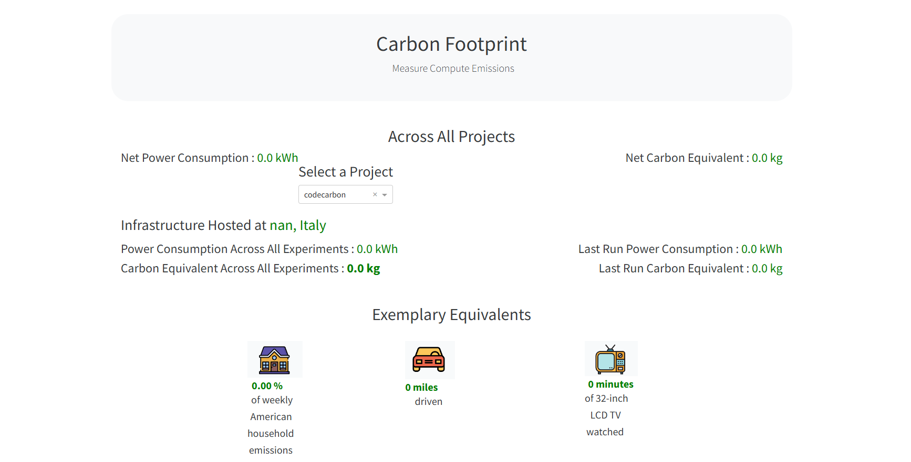
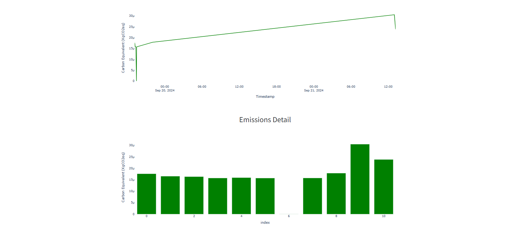
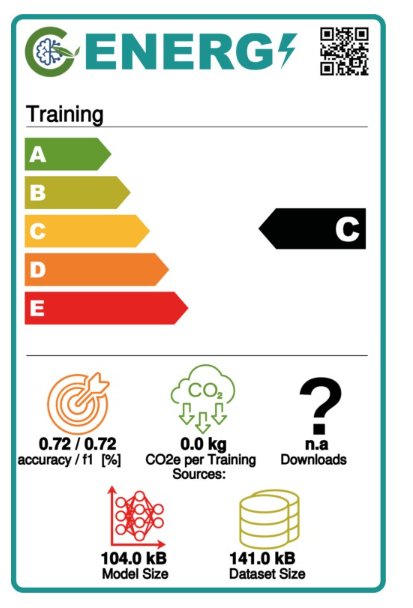

# Model Card — Crop Classification Model

## Overview

This model card provides essential information about the
**Crop Classification Model** trained to predict the most
suitable crop based on soil and environmental conditions.

| Field              | Details                  |
| ------------------ | ------------------------ |
| **Model Type**     | Random Forest Classifier |
| **Version**        | 2.0.0                    |
| **Accuracy**       | 94.32%                   |
| **Input Features** | 7 numerical features     |
| **Output Classes** | 22 crop types            |
| **Framework**      | Scikit-learn 1.5.1       |
| **Tracking**       | MLflow + DagsHub         |
| **Last Updated**   | May 2026                 |

---

## Objective

Assist farmers and agricultural professionals in choosing
the most suitable crop based on soil and environmental
conditions, reducing crop failure and improving yield.

---

## Input Features

| Feature     | Description                | Unit  | Range |
| ----------- | -------------------------- | ----- | ----- |
| Nitrogen    | Nitrogen content in soil   | kg/ha | 0-140 |
| Phosphorus  | Phosphorus content in soil | kg/ha | 0-145 |
| Potassium   | Potassium content in soil  | kg/ha | 0-205 |
| Temperature | Regional temperature       | °C    | 0-50  |
| Humidity    | Regional humidity          | %     | 0-100 |
| pH Value    | Soil acidity/alkalinity    | pH    | 0-14  |
| Rainfall    | Regional rainfall          | mm    | 0-300 |

---

## Output Classes

22 crop types:

`Apple` `Banana` `Blackgram` `ChickPea` `Coconut`
`Coffee` `Cotton` `Grapes` `Jute` `KidneyBeans`
`Lentil` `Maize` `Mango` `MothBeans` `MungBean`
`Muskmelon` `Orange` `Papaya` `PigeonPeas`
`Pomegranate` `Rice` `Watermelon`

---

## Model Architecture

| Parameter         | Value                  |
| ----------------- | ---------------------- |
| Algorithm         | RandomForestClassifier |
| n_estimators      | 200                    |
| max_depth         | None                   |
| min_samples_split | 2                      |
| class_weight      | balanced               |
| random_state      | 42                     |
| Train/Test Split  | 80/20                  |
| Training Samples  | 1760                   |
| Test Samples      | 440                    |

---

## Performance Metrics

### Version Comparison

| Metric        | v1.0   | v2.0       | Improvement |
| ------------- | ------ | ---------- | ----------- |
| **Accuracy**  | 72.5%  | **94.32%** | +21.82%     |
| **Precision** | 0.8527 | **0.9630** | +11.03%     |
| **Recall**    | 0.7250 | **0.9432** | +21.82%     |
| **F1-Score**  | 0.6601 | **0.9333** | +27.32%     |

### Per Class Performance

| Crop        | Precision | Recall | F1-Score | Support |
| ----------- | --------- | ------ | -------- | ------- |
| Apple       | 1.00      | 1.00   | 1.00     | 23      |
| Banana      | 1.00      | 1.00   | 1.00     | 21      |
| Blackgram   | 0.83      | 1.00   | 0.91     | 20      |
| ChickPea    | 1.00      | 1.00   | 1.00     | 26      |
| Coconut     | 1.00      | 1.00   | 1.00     | 27      |
| Coffee      | 0.85      | 1.00   | 0.92     | 17      |
| Cotton      | 1.00      | 1.00   | 1.00     | 17      |
| Grapes      | 1.00      | 1.00   | 1.00     | 14      |
| Jute        | 1.00      | 0.17   | 0.30     | 23      |
| KidneyBeans | 1.00      | 1.00   | 1.00     | 20      |
| Lentil      | 0.85      | 1.00   | 0.92     | 11      |
| Maize       | 1.00      | 1.00   | 1.00     | 21      |
| Mango       | 1.00      | 1.00   | 1.00     | 19      |
| MothBeans   | 1.00      | 0.75   | 0.86     | 24      |
| MungBean    | 1.00      | 1.00   | 1.00     | 19      |
| Muskmelon   | 1.00      | 1.00   | 1.00     | 17      |
| Orange      | 1.00      | 1.00   | 1.00     | 14      |
| Papaya      | 1.00      | 1.00   | 1.00     | 23      |
| PigeonPeas  | 1.00      | 1.00   | 1.00     | 23      |
| Pomegranate | 1.00      | 1.00   | 1.00     | 23      |
| Rice        | 0.54      | 1.00   | 0.70     | 19      |
| Watermelon  | 1.00      | 1.00   | 1.00     | 19      |

---

## MLflow Experiment Tracking

All experiments tracked on DagsHub:

- 🔗 [View Experiments](https://dagshub.com/ushafique/CropClassification)
- 20+ training and evaluation runs logged
- Parameters, metrics and models versioned

---

## 🌱 Carbon Footprint

### CodeCarbon Dashboard



### Emissions Over Time



### Energy Efficiency Label



| Metric            | Value  |
| ----------------- | ------ |
| CO2 per Training  | 0.0 kg |
| CO2 per Inference | 0.0 kg |
| Model Size        | 104 kB |
| Dataset Size      | 141 kB |
| Energy Rating     | C      |
| Infrastructure    | Italy  |

Carbon tracking implemented using
[CodeCarbon](https://codecarbon.io/).
This project maintains minimal carbon footprint
due to efficient model architecture and
optimized inference pipeline.

---

## Fairness and Bias

- **Class Imbalance**: Addressed using
  `class_weight="balanced"` in Random Forest
- **Geographical Bias**: Trained on specific
  regional data — may not generalize to all regions
- **Low Performing Classes**: Jute (F1=0.30)
  and Rice (F1=0.70) need more training data

---

## Model Limitations

- **Data Drift**: Sensitive to changing environmental
  conditions — monitored using Alibi Detect
- **Outliers**: May perform poorly with extreme
  input values
- **Regional**: Not validated for all global regions
- **Jute**: Currently underperforming —
  needs more data

---

## Intended Use

| Use Case                          | Supported |
| --------------------------------- | --------- |
| Crop recommendation for farmers   | ✅ Yes    |
| Agricultural decision support     | ✅ Yes    |
| Real-time API predictions         | ✅ Yes    |
| Crop yield prediction             | ❌ No     |
| Unseen geographical regions       | ❌ No     |
| Unmonitored production deployment | ❌ No     |

---

## Ethical Considerations

- **Fairness**: Should not disadvantage
  small-scale farmers or specific regions
- **Transparency**: All predictions via API
- **Data Privacy**: No personal data collected
- **Human Oversight**: Recommendations should
  be verified by agricultural experts

---

## API Usage

```bash
POST http://localhost:8000/predict

{
    "Nitrogen": 50,
    "Phosphorus": 30,
    "Potassium": 40,
    "Temperature": 20.0,
    "Humidity": 60.0,
    "pH_Value": 6.0,
    "Rainfall": 100.0
}
```

Response:

```json
{
  "predicted": "Rice",
  "message": "Prediction successful"
}
```

---

## Version History

| Version | Date     | Accuracy | Changes                                   |
| ------- | -------- | -------- | ----------------------------------------- |
| 1.0.0   | Sep 2024 | 72.5%    | Initial model                             |
| 2.0.0   | May 2026 | 94.32%   | Improved hyperparameters, class balancing |

---

## References

- [Kaggle Dataset](https://www.kaggle.com/datasets/atharvaingle/crop-recommendation-dataset)
- [Scikit-learn RandomForest](https://scikit-learn.org/stable/modules/generated/sklearn.ensemble.RandomForestClassifier.html)
- [MLflow](https://mlflow.org/docs/latest/index.html)
- [CodeCarbon](https://codecarbon.io/)
- [Great Expectations](https://greatexpectations.io/)

---

## Author

**Ushafique**

- GitHub: [@ozairshafique](https://github.com/ozairshafique)
- DagsHub: [@ushafique](https://dagshub.com/ushafique)
